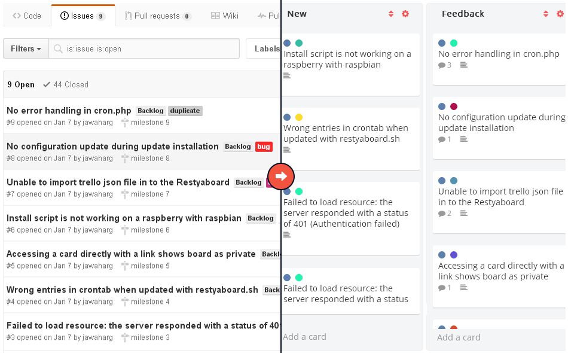

### Import from GitHub

- Login with your GitHub account.
- Creates new boards for each GitHub repositories.
- Creates users with password "restya" and email as empty for each repository users from GitHub.
- Assigns created users as board members.
- Creates default lists for each board which are New, Assigned, InProgress, Feedback, Closed.
- Inserts every issue as a card in the list based on following criteria:

  - If issue state is not equal to open, issue will be added as a card in "Closed" list.
  - If issue comment count is not equal zero, issue will be as a card added in "Feedback" list.
  - If issue has milestone date, issue will be added as a card in "InProgress" list.
  - If issue assigned to user, issue will be added as a card in "Assigned" list.
  - If any above criteria is not matched, issue will be added as a card in "New" list.

- Assigns labels to each cards, milestone date to card due date and assigned users to card members.
- Inserts issue comments to respective card comments.

