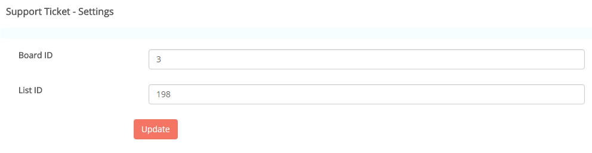

### Support Ticket

- Help desk or support ticket system or customer service software using Restyaboard.

### How it works

- Embed front-end widget similar to Samanage in a website to receive tickets from customers
- Tickets will be stored in TODO board and under TODO list in a card
- You can use kanban workflow in handling tickets

